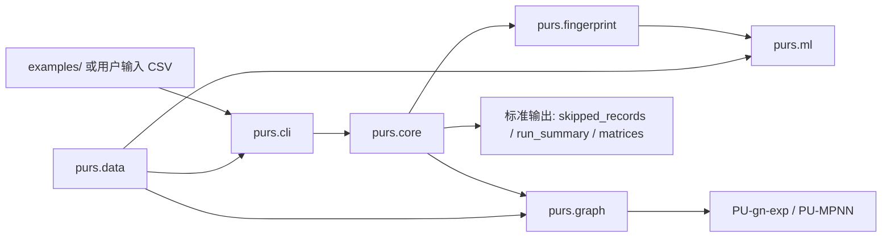

# 程序包架构

## 1. 总体思路

这个程序包的核心结构是：

`polymer SMILES -> PURS core -> PUFp / PUGraph -> downstream tasks`

也就是说，它不是三套彼此独立的代码，而是：

- 一个共享核心
- 两条主要下游分支
- 一层统一命令入口
- 一套面向发布的样例入口

## 2. 架构总图

## 3. 分层说明

### 3.1 统一入口层

位置：

- `src/purs/cli.py`

职责：

- 对外暴露统一命令
- 分发到核心模块
- 尽量不承载具体算法逻辑

当前统一命令包括：

- `purs recognize`
- `purs classify`
- `purs fingerprint`
- `purs ml rf|krr|svm`
- `purs graph build`
- `purs graph train`

这一层的目标很明确：

- 用户只需要记住 `purs ...`
- 内部实现可以逐步替换或整理

### 3.2 共享核心层 `purs.core`

位置：

- `src/purs/core/`

职责：

- 输入列识别与标准化
- `SMILES` 清洗
- polymer-unit 识别
- polymer-unit 分类
- 标准输出文件生成

关键文件：

- `recognize.py`
- `classify.py`
- `io.py`
- `outputs.py`
- `smiles.py`

这一层是整个程序包的真正中枢。
`PUFp` 和 `PUGraph` 都依赖它的输出。

### 3.3 指纹层 `purs.fingerprint`

位置：

- `src/purs/fingerprint/`

职责：

- 从共享核心结果生成 `PUFp`
- 输出 one-hot、number、adjacency 等特征表

关键文件：

- `build.py`
- `features.py`

这条线可以理解成：

`PURS core -> polymer-unit fingerprint tables`

### 3.4 传统机器学习层 `purs.ml`

位置：

- `src/purs/ml/`

职责：

- 传统回归模型
- 传统分类模型
- 特征与目标对齐
- 指标计算
- 多种特征源融合

当前已经包含：

- 回归：
  - `rf.py`
  - `krr.py`
  - `svm.py`
- 分类：
  - `classification.py`
- 公共支持：
  - `common.py`
  - `feature_fusion.py`

这一层目前支持的特征来源已经不只是 `PUFp`，还包括：

- `PUFp`
- `Raw Features`
- `Descriptors`
- 它们的融合

### 3.5 图分支 `purs.graph`

位置：

- `src/purs/graph/`

职责：

- 构建 graph 输入
- 生成 graph manifest
- 生成训练配置
- 统一包装图后端

关键文件：

- `builders.py`
- `dataset.py`

这层下面目前有两个后端方向：

- `pu_gn_exp`
- `pu_mpnn`

同时还保留了兼容桥：

- `legacy_purs_adapter.py`
- `legacy_mpnn_adapter.py`

因此这层的现实定位是：

- 上层接口已统一
- 内部后端仍部分保留 legacy 结构

### 3.6 数据任务层 `purs.data`

位置：

- `src/purs/data/`

职责：

- 维护统一样例数据 schema
- 从 OPECM 原始表派生任务表
- 生成 paper-style 标签或标准样例标签

关键文件：

- `osc_tasks.py`

这一层的意义很大，因为它把“散乱示例 CSV”提升成了“有规则的数据层”。

## 4. 发布视角下的结构

如果按发布包来理解，这个仓库更适合分成三圈：

### 4.1 用户入口圈

- `README.md`
- `examples/`

这是对外最重要的一层。
发布时应该优先让用户从这里进入。

### 4.2 核心实现圈

- `src/purs/`

这是程序包本体：

- `purs.core`
- `purs.fingerprint`
- `purs.ml`
- `purs.graph`
- `purs.data`

### 4.3 维护支撑圈

- `docs/`
- `tests/`
- `scripts/`
- `repro/`

这层主要用于：

- 开发维护
- 方法映射
- 内部验收

但不应该成为用户第一次打开仓库时的主入口。

## 5. 数据与样例的角色

当前仓库里的数据分工应当这样理解：

- `examples/`
  - 面向用户的轻量样例
- `data/testing/`
  - 标准化样例数据与任务表
- `tests/fixtures/`
  - 极小型回归测试夹具
- `repro/`
  - 方法映射与论文相关材料

这几层不要混用。

## 6. 当前最推荐的使用路径

对于发布包，推荐路径是：

1. 先看 `examples/README.md`
2. 先跑 `repro/supplementary_examples/basic_recognition/`
3. 再跑 `repro/supplementary_examples/pufp_mobility_demo/`
4. 最后跑 `repro/supplementary_examples/pugraph_demo/`

如果需要查看程序包已经实际跑通的发布前验收，可再看：

- `docs/package_release_validation.md`

## 7. 一句话总结

当前这个程序包的架构可以概括为：

- 一层统一 CLI
- 一个共享 `PURS core`
- 两条主要下游分支：`PUFp + ML` 与 `PUGraph`
- 一个统一数据任务层 `purs.data`
- 一套发布优先的 `examples/` 入口

这也是它当前最适合对外发布的组织方式。
